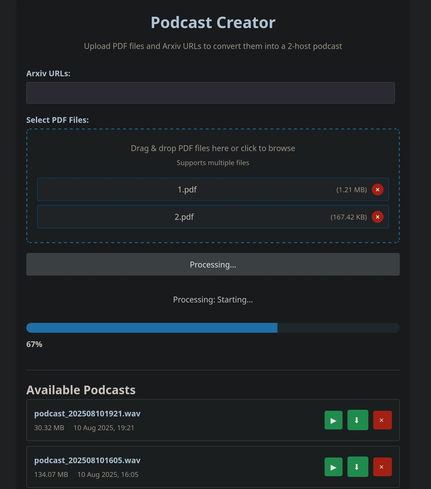

# Podcast Creator

A tool that converts PDF content into a 2-host podcast using LLM and TTS APIs.



## Overview

Podcast Creator is a comprehensive solution for transforming PDF documents and Arxiv papers into engaging, two-host podcasts. It leverages advanced LLM (Large Language Model) and TTS (Text-to-Speech) technologies to generate natural-sounding conversations between virtual hosts. The system is designed for easy deployment and integration, with a robust HTTP API interface.

## Features

- PDF content extraction from uploaded files and Arxiv URLs
- LLM-powered podcast generation in a 2-host format with natural conversation flow
- OpenAI-compatible LLM and TTS integration
- WAV audio stitching for seamless podcast creation
- Dockerized deployment for easy setup and scaling
- HTTP API interface for programmatic access
- Configuration via environment variables

## Planned Features

- Agentic LLM tool-use for information retrieval (e.g. date, web search, etc) for more relevant and up to date information for the podcast
- Updated UI/Frontend with more configurations exposed to control podcast generation
- Memory integration to support retrieval from "previous episodes", developed host personalities, likes/dislikes, etc

## Available Endpoints

### 1. Create Podcast
**POST** `/podcasts`

Initiates podcast generation from PDF files or Arxiv URLs.

**Request Parameters:**
- `files` (optional if arxiv_urls exists): List of PDF files to process
- `arxiv_urls` (optional if files exists): List of Arxiv URLs to process

**Response:**
```json
{
  "job_id": "unique-job-identifier",
  "status": "processing",
  "created_at": "timestamp"
}
```

### 2. Get Podcast Status
**GET** `/podcasts/status/{job_id}`

Retrieves the status of a podcast generation job.

**Path Parameters:**
- `job_id`: Unique identifier for the job

**Response:**
```json
{
  "job_id": "unique-job-identifier",
  "status": "processing/completed/failed",
  "progress": 0-100,
  "result_file": "filename.mp3" (if completed)
}
```

### 3. Download Podcast
**GET** `/podcasts/download/{filename}`

Downloads the generated podcast file.

**Path Parameters:**
- `filename`: Filename of the podcast to download

## Environment Variables

The following environment variables can be configured:

### API Settings
- `ALLOWED_ORIGINS`: Comma-separated list of allowed origins for CORS (default: `*`)

### Podcast Settings
- `HOST_A_NAME`: Name for speaker A
- `HOST_B_NAME`: Name for speaker B

### LLM Settings
- `LLM_API_HOST`: URL for the LLM service (default: "http://192.168.1.16:8000")
- `LLM_MODEL`: LLM model to use (default: "Mistral-Small-3.2-FP8")
- `LLM_TEMPERATURE`: Temperature setting for LLM (default: 0.6)
- `LLM_TIMEOUT`: Timeout for LLM requests in seconds (default: 600)

### TTS Settings
- `TTS_API_HOST`: URL for the TTS service (default: "http://192.168.1.16:8000")
- `TTS_API_PATH`: API path (default: "/v1/audio/speech")
- `TTS_MODEL`: TTS model to use (default: "Kyutai-TTS-Server")
- `TTS_TIMEOUT`: Timeout for TTS requests in seconds (default: 60)
- `TTS_WAKEUP_ENDPOINT`: (Optional) API ENDPOINT that will call a GET with 60 second timeout to "wake up the server"

### System Settings
- `AUDIO_STORAGE_PATH`: Directory to store generated audio files (default: "./audio_storage")
- `MAX_FILE_SIZE`: Maximum allowed file size in bytes (default: 10,485,760 bytes / 10MB)

## Deployment

The application can be deployed using Docker. A `docker-compose.yml` file is provided for easy setup.

## Development

For local development, install the required dependencies:

```bash
pip install -r requirements.txt
```

Start the application:

```bash
uvicorn app.main:app --host 0.0.0.0 --port 8000
```

## License

This project is licensed under the MIT License.